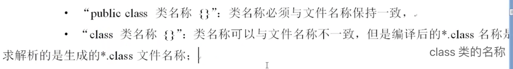

# Java新手入门

## 环境准备

红条表示 Oracle JDK 的生命周期支持，蓝条表示 Open JDK 生命周期支持

## Java语法基础

### Java编程入门

Java 的发展并不是一帆风顺的，但是 Java 依然是一个稳定可靠的编程语言。可以承担大型服务器的程序开发任务

Java 的不同发展阶段

- Java 标准程序: Java SE, 提供底层技术支持，实现了桌面程序的开发
- Java 嵌入式开发：Java ME, 
- Java 嵌入式开发：Java EE, 进行企业平台搭建，现在主要开发的是互联网平台

Java 之所以可以得到持续的发展以及良好的生态系统，取决于

- 是一个行业内通用的技术实现标准，半开源被外界知道（彼时的竞品是.net）
- 是一门面向对象的编程语言，方便开发，并且JDK在不断扩充
- 提供了自动的内存回收机制
- 避免了复杂的指针问题，而使用更加简单的引用代替指针（类比C）
- Java 是为数不多的支持多线程编程的开发语言
- Java 提供高效的网络处理能力，可以给予 NIO 实现更加高效的数据在传输
- Java 具有良好的可移植性
- Java 语言足够简单

**Java 语言的可移植性**

同一个程序可以在不同操作系统之间任意部署，这样就减少了开发的难度

在 Java 中，主要是以依靠 JVM，JVM 是一个有软件和硬件模拟出来的计算机， 所有程序只要有 JVM 支持， 那就可以实现程序的执行，并且不同操作系统上会有不同版本的JVM存在，如此就可以实现移植性

Java 语言属于编译型与解释型的开发语言

所有的 Java 程序的解释都要求放在JVM上处理

所有的程序并不是直接运行在操作系统上，而是通过 JVM 执行，这样一来，肯定要比直接在操作系统上执行程序的处理速度要慢。
先期这的确是一个问题，但是后来由于硬件技术的飞速发展，这些问题已经可以忽略了，但是依然存在有 JVM 调优的问题

安装和配置JDK之后，就可以开始写第一个Java程序了 -- Hello World

提示

- Java 语言有着明确的命名要求，定义类名称要求每一个单词首字母大写
- 主方法是所有程序执行的起点，并且一定要定义在类中。主方法所在类统称“主类”

**CLASSPATH**

当设置了 CLASSPATH 之后，这个时候 Java 程序解释的时候就会自动通过 CLASSPATH 设置的路径进行类的加载，由此可以得出一个结论：
- JVM 解释器解释程序的时候需要得到 CLASSPATH 的支持
  但是又有一个问题了，发现默认情况下都是从当前所在的目录中加载的，由此可以得出一个结论：
- CLASSPATH 的默认设置为当前所在目录加载类文件

命令行的方式只是临时的，如下方式才是最佳的

PATH 和 CLASSPATH 的区别

- PATH: 是操作系统提供的路径了配置，定义所有可执行程序的路径
- CLASSPATH： 是由 JRE提供的，用于在 Java 程序解释时类加载路径，默认设置为当前所在目录
  可以通过 `set CLASSPATH=your_path` 的命令形式来定义

#### Java 基本概念

**标识符与关键字**

**数据类型**
- 基本数据类型
  - 数值型
    - 整型 byte, short, int, long  | 默认值: 0
    - 浮点型 float, double         | 默认值: 0.0
  - 布尔型 boolean                 | 默认值: false
  - 字符型 char                    | 默认值: \u0000
- 引用数据类型 数组，类，接口          | 默认值: null
  
**数据保存范围**

参考原则：
- 描述数字首选 int 和 double
- 如何需要进行数据传输和字节编码使用 byte
- 处理中文的时候最方便操作 char
- 描述内存和文件大小，描述表的主键列 null

整型计算超过范围会怎么样？ 数据溢出

- 提前预知，扩大使用范围
- 数据后面加 L 或者转化为 long
  

数据类型之间是可以转化的，即：范围小的数据类型可以自动转化为范围大的数据类型，但是反过来，范围大的数据类型要转换为范围小的数据类型，那么就必须采取强制性的处理模式，同时还需要考虑会带来的数据溢出

给 byte 赋值 如果超出 byte 范围，需要进行强制转换。否则可以自动由 int 转换为 byte

### Java面向对象编程

### Java高级编程

## 数据库开发

# Java初级工程师

